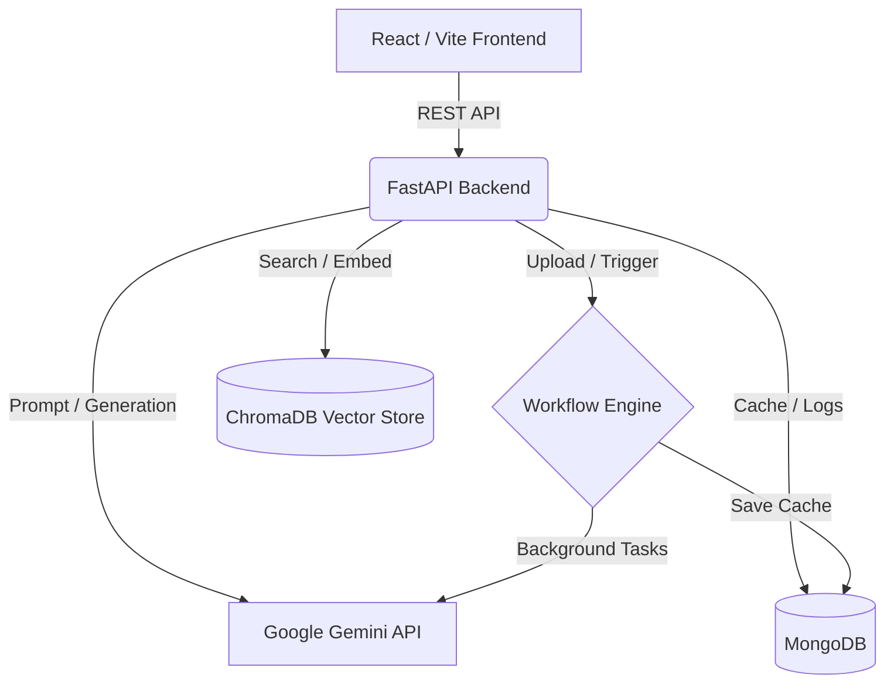

# DocMind Workbench 🧠

DocMind Workbench is an AI-powered document intelligence platform. It allows users to upload PDF documents, extract their contents into an embedded Vector Database, and utilize Google's Gemini LLM to chat with the document, generate executive summaries, create interactive quizzes, and build flashcards.


---

## ✨ Features

- **Hybrid Search RAG Pipeline:** Combines ChromaDB vector search with BM25 keyword search, passed through a Cross-Encoder reranker for maximum retrieval accuracy.
- **Smart Task Automations:** Background workflow engine automatically runs AI tasks (like Summarization) when documents are uploaded.
- **Database Caching:** Results are cached in MongoDB to prevent redundant LLM API calls and eliminate wait times for previously generated tasks.
- **Rich Interactive UI:** Beautiful glassmorphism frontend built with React, Tailwind CSS v4, and Zustand. Features dark/light mode and interactive flashcard grids.
- **Unified Chat Interface:** Talk to your documents and generate structured learning materials right inside the same chat stream.

## 🏗️ Architecture



## 🚀 Getting Started

### Prerequisites
- Docker & Docker Compose
- Google Gemini API Key

### Deploying with Docker (Recommended)

1. Clone the repository:
   ```bash
   git clone https://github.com/yourusername/DocMind-Workbench.git
   cd DocMind-Workbench
   ```

2. Export your Gemini API key so Docker can see it:
   ```bash
   # Windows PowerShell
   $env:GEMINI_API_KEY="your-api-key-here"
   
   # Mac/Linux
   export GEMINI_API_KEY="your-api-key-here"
   ```

3. Spin up the cluster:
   ```bash
   docker compose up --build -d
   ```

4. Access the application:
   - Frontend UI: `http://localhost:80`
   - Backend API Docs: `http://localhost:8000/docs`

### Local Development Setup

If you prefer to run the services manually without Docker:

**1. Database**
Ensure you have MongoDB running locally on `localhost:27017`.

**2. Backend**
```bash
cd backend
python -m venv venv
source venv/bin/activate  # (or `venv\Scripts\activate` on Windows)
pip install -r requirements.txt

# Create a .env file
echo "GEMINI_API_KEY=your_key_here" > .env
echo "MONGODB_URI=mongodb://localhost:27017" >> .env

uvicorn main:app --reload
```

**3. Frontend**
```bash
cd frontend
npm install
npm run dev
```

---

## 🛠️ Tech Stack

- **Frontend:** React, Vite, Tailwind CSS v4, Zustand, Axios
- **Backend:** Python, FastAPI, Motor (Async PyMongo), BackgroundTasks
- **AI/ML:** Google Gemini 2.5 Flash, ChromaDB, SentenceTransformers (MiniLM-L6-v2), CrossEncoder (ms-marco-MiniLM-L-6-v2)
- **Database:** MongoDB
- **Deployment:** Docker, Nginx

## 📝 License
MIT License
