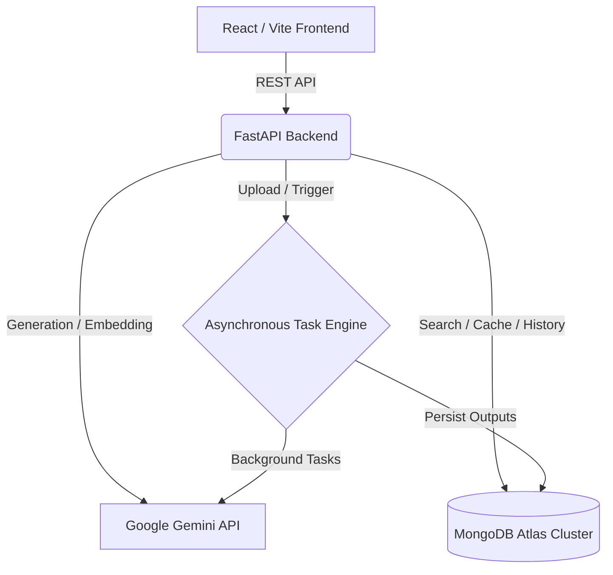

# DocMind Workbench

DocMind Workbench is an elite, AI-powered document intelligence platform designed to seamlessly transform static files into interactive, actionable data. It features a stunning, dynamic UI that automatically adapts to the type of document you upload, providing highly specialized workflows alongside robust, hybrid-search capabilities.

---

## 🏛️ 10/10 Enterprise Architecture

The platform was meticulously engineered to provide an enterprise-grade, highly resilient experience without the massive hardware overhead typically required by AI applications.

- **Zero-RAM Serverless Embeddings:** Replaced local PyTorch models (`SentenceTransformers`) with Google's `gemini-embedding-2` REST API. This batch-processing pipeline offloads heavy matrix computations to Google, eliminating over 350MB of server memory overhead and ensuring flawless free-tier deployments without Out-Of-Memory (OOM) crashes.
- **Mathematical Hybrid Search:** Replaced compute-heavy neural Cross-Encoders with **Reciprocal Rank Fusion (RRF)**. RRF merges MongoDB Atlas Semantic Vector Search (3072D) with BM25 Keyword Search, achieving state-of-the-art hybrid search retrieval with zero compute overhead.
- **Unified Cloud State:** Fully migrated from local SQLite/ChromaDB to MongoDB Atlas Vector Search, consolidating document caches, user chat histories, and high-dimensional embeddings into a single managed, lightning-fast cluster.

---

## ✨ Features that WOW

### 1. The Dashboard & Complete App Experience
- **Welcome Dashboard:** A clean, modern entry point to view recent documents, manage workspaces, and seamlessly dive back into active projects.
- **Persistent State:** Reopen old documents and instantly access previous AI outputs, chat histories, and cached workflows. No lost work.
- **Robust Error Handling:** Beautiful loading skeletons, robust API retry states, and dynamic `ErrorBoundary` components prevent white-screen crashes and ensure a premium user experience.

### 2. Intelligent, Transparent Retrieval
- **Hybrid Search RAG:** By fusing Vector Search with BM25 Keyword Search, the AI never misses critical context.
- **Rich Source Citations:** Every AI answer is backed by interactive, expandable citation drawers.
- **Confidence Scoring:** Each retrieved chunk displays exact page-level references and an intelligent "Match %" derived directly from the underlying RRF distance score, telling you exactly *why* a chunk was chosen.

### 3. Event-Driven Workflows & Dynamic UI
DocMind doesn't just read documents; it understands them. We built an intelligent background engine that completely adapts the app based on your data.

- **AI Document Classification:** The moment a file is uploaded, a background FastAPI task secretly reads the first few pages and uses `gemini-flash-latest` to classify it (e.g., Resume, Academic Paper, Job Description, General Document).
- **Dynamic Interface Morphing:** The UI reacts instantly to the classification, injecting specialized workflow buttons:
  - **General Documents:** Access standard tools like Chat, Summarize, Quiz, and Flashcards.
  - **Resumes:** The UI injects an **Extract Skills** button and a **Score Match** button. The AI acts as a ruthless Senior Engineering Manager, deducing the targeted role, strictly grading the candidate out of 100, and returning the output as a beautiful React UI card.
  - **Academic Papers:** The UI injects an **Extract Claims** button to instantly parse the core hypothesis and limitations of the paper.

### 4. Flawless Deployment Reliability
- Strictly adheres to a sub-512MB memory footprint.
- Robust markdown-stripping and JSON sanitization on both the frontend and backend ensure the UI never crashes, even if the AI hallucinates formatting.
- Graceful degradation for Rate Limits (HTTP 429) and Server Overloads (HTTP 503).

---

## 🏗️ Data Flow

## 🛠️ Tech Stack

- **Frontend:** React, Vite, Tailwind CSS v4, Zustand, Axios
- **Backend:** Python, FastAPI, Motor (Async PyMongo)
- **AI/ML:** Google Gemini (flash-latest, gemini-embedding-2), Reciprocal Rank Fusion (RRF), BM25
- **Database:** MongoDB Atlas (Document + Vector Search)
- **Deployment:** Render (Backend API), Vercel (Frontend Client)

## 📝 License
MIT License
